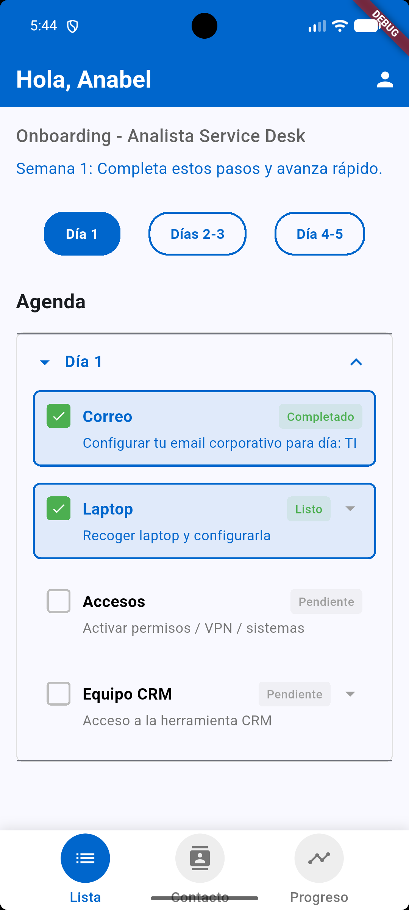
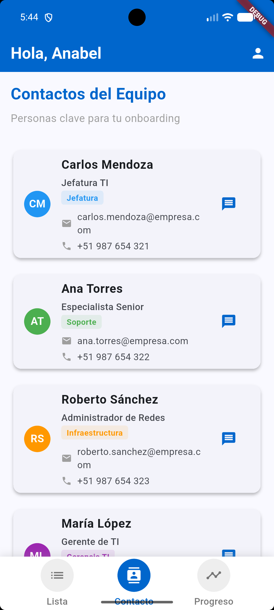
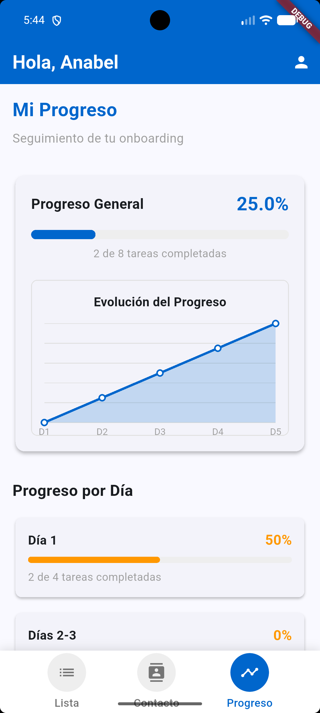
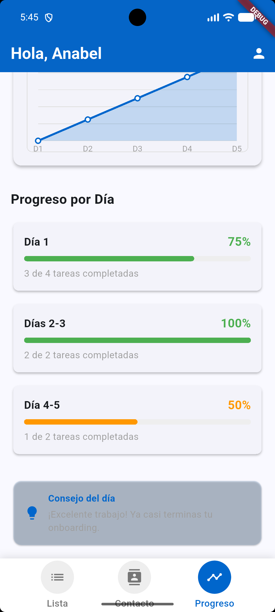

Onboarding Service Desk App
https://img.shields.io/badge/Flutter-3.x-blue
https://img.shields.io/badge/Dart-3.x-blue
https://img.shields.io/badge/License-MIT-green

Aplicación móvil desarrollada en Flutter para gestionar el proceso de onboarding de nuevos analistas en un Service Desk. Esta app permite dar seguimiento a las tareas de integración, contactar con diferentes áreas y visualizar el progreso de manera interactiva.


📱 Capturas de Pantalla
<div align="center">     </div>


✨ Características Principales
📋 Pantalla de Lista
Pestañas interactivas: Día 1, Días 2-3, Día 4-5

Tareas clickeables que cambian de estado (Completado/En curso/Pendiente)
Checklist visual con checkboxes
Estados con colores distintivos:

✅ Verde: Completado/Listo
⏳ Naranja: En curso
⭕ Gris: Pendiente

👥 Pantalla de Contactos
4 contactos clave de diferentes áreas:
Botón para enviar mensaje

📊 Pantalla de Progreso
Barra de progreso general con porcentaje en tiempo real
Gráfico lineal personalizado que muestra la evolución del progreso
Detalle por día con barras de progreso individuales
Consejos motivacionales que cambian según el avance:
< 30%: "Comienza por las tareas más importantes"
30-70%: "Vas por buen camino. Sigue completando las tareas"
70%: "¡Excelente trabajo! Ya casi terminas tu onboarding"

Cálculo automático del progreso total basado en checklists

🎯 Funcionalidades Interactivas
✅ Tareas clickeables: Cada tarea se puede marcar/desmarcar
🔄 Actualización en tiempo real: El progreso se actualiza automáticamente
📱 Navegación fluida: Entre Lista, Contactos y Progreso
🎨 Interfaz responsive: Se adapta a diferentes tamaños de pantalla

🛠️ Tecnologías Utilizadas
Flutter - Framework UI
Dart - Lenguaje de programación
Material Design 3 - Sistema de diseño
CustomPainter - Para gráficos personalizados

📦 Estructura del Proyecto
text
lib/
└── main.dart                 # Archivo principal con toda la lógica

android/                      # Configuración nativa de Android
ios/                          # Configuración nativa de iOS
🚀 Cómo Ejecutar el Proyecto
Prerrequisitos
Flutter SDK (versión 3.x o superior)
Dart SDK (versión 3.x o superior)
Android Studio / VS Code
Emulador Android o dispositivo físico

Pasos
bash
# 1. Clonar el repositorio
git clone https://github.com/tuusuario/onboarding-service-desk.git
cd onboarding-service-desk

# 2. Instalar dependencias
flutter pub get

# 3. Ejecutar la aplicación
flutter run
Generar APK
bash
# APK de depuración
flutter build apk --debug

# APK de release
flutter build apk --release

# APK dividido por arquitectura (tamaño reducido)
flutter build apk --split-per-abi
Los APKs se generarán en: build/app/outputs/flutter-apk/

📱 Cómo Usar la App
Pantalla de Lista: Marca/desmarca las tareas completadas

Pantalla de Contactos: Visualiza la información de contacto del equipo
Pantalla de Progreso: Monitorea tu avance en tiempo real
Navegación: Usa el menú inferior para cambiar entre pantallas

🎨 Paleta de Colores
Azul corporativo (#0066CC): Color principal
Verde: Tareas completadas
Naranja: Tareas en curso
Gris: Tareas pendientes


📄 Licencia
Este proyecto está bajo la Licencia MIT - ver el archivo LICENSE para más detalles.

📧 Contacto
Desarrollador: [Noah]
GitHub: @spainbarca
LinkedIn: https://pe.linkedin.com/in/noe-joel-martinez-hancco-7024782a5
Email: spain.barcelona.1999@gmail.com

<div align="center"> Desarrollado con ❤️ usando Flutter </div> ```
